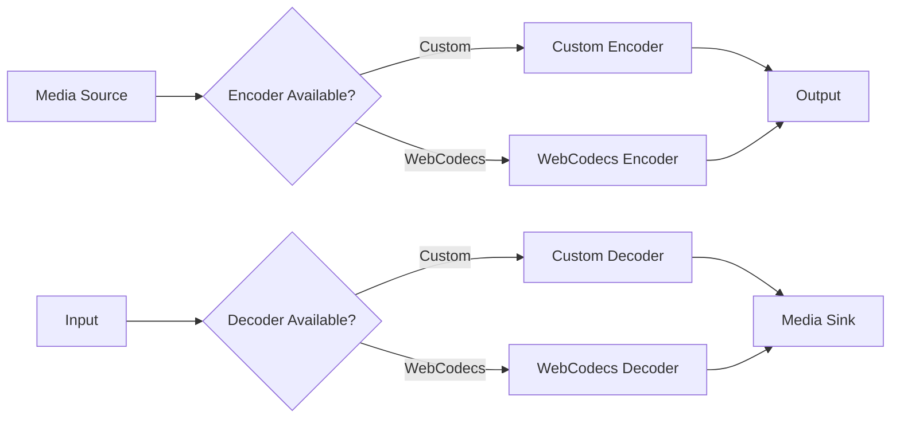

Mediabunny's custom coder API allows you to extend the library with your own encoding and decoding implementations. This is useful for adding support for codecs not natively supported by browsers, implementing specialized encoders/decoders, or polyfilling missing WebCodecs support.

## When to use custom coders

<CardGroup cols={2}>
  <Card title="Missing codec support" icon="puzzle-piece">
    Add support for codecs not available in the browser's WebCodecs implementation (e.g., MP3, AC3).
  </Card>
  
  <Card title="Polyfilling" icon="shield">
    Provide fallback implementations when WebCodecs is unavailable or doesn't support a specific codec.
  </Card>
  
  <Card title="Specialized encoding" icon="sliders">
    Implement custom encoding logic with specific quality/performance characteristics.
  </Card>
  
  <Card title="Hardware integration" icon="microchip">
    Interface with custom hardware encoders/decoders or external encoding services.
  </Card>
</CardGroup>

## Architecture

Custom coders integrate seamlessly into Mediabunny's encoding and decoding pipeline:



When you register a custom coder, Mediabunny automatically uses it when:
1. The custom coder's `supports()` method returns `true`
2. A native WebCodecs implementation is unavailable or doesn't support the configuration

## Custom video encoder

Create a custom video encoder by extending `CustomVideoEncoder`:

```typescript src/custom-coder.ts
import { CustomVideoEncoder, registerEncoder } from 'mediabunny';

class MyVideoEncoder extends CustomVideoEncoder {
  // Check if this encoder can handle the given codec and config
  static supports(codec: VideoCodec, config: VideoEncoderConfig): boolean {
    return codec === 'hevc' && config.width <= 4096;
  }

  // Initialize encoder
  async init(): Promise<void> {
    // Set up your encoder
    // Access config via: this.codec, this.config
  }

  // Encode a video sample
  async encode(
    videoSample: VideoSample,
    options: VideoEncoderEncodeOptions
  ): Promise<void> {
    // Extract frame data
    const videoFrame = videoSample.toVideoFrame();
    
    // Your encoding logic here...
    const encodedData = await myEncodingFunction(videoFrame, options.keyFrame);
    
    // Create packet from encoded data
    const packet = new EncodedPacket(
      encodedData,
      options.keyFrame ? 'key' : 'delta',
      videoSample.timestamp,
      videoSample.duration
    );
    
    // Output the packet (with optional metadata)
    this.onPacket(packet, {
      decoderConfig: {
        codec: 'hev1.1.6.L93.B0',
        codedWidth: this.config.width,
        codedHeight: this.config.height,
      },
    });
    
    videoFrame.close();
  }

  // Flush any buffered frames
  async flush(): Promise<void> {
    // Flush your encoder
  }

  // Clean up resources
  async close(): Promise<void> {
    // Release encoder resources
  }
}

// Register the encoder
registerEncoder(MyVideoEncoder);
```

**Key points:**
- `supports()` determines when your encoder is used
- Access codec and config via readonly properties
- Call `this.onPacket()` for each encoded packet
- Include decoder config metadata in the first `onPacket()` call

**Source code:** [src/custom-coder.ts:80-102](/home/daytona/workspace/source/src/custom-coder.ts#L80-L102)

## Custom video decoder

Create a custom video decoder by extending `CustomVideoDecoder`:

```typescript src/custom-coder.ts
import { CustomVideoDecoder, registerDecoder } from 'mediabunny';

class MyVideoDecoder extends CustomVideoDecoder {
  static supports(codec: VideoCodec, config: VideoDecoderConfig): boolean {
    return codec === 'hevc';
  }

  async init(): Promise<void> {
    // Initialize your decoder
    // Access config via: this.codec, this.config
  }

  async decode(packet: EncodedPacket): Promise<void> {
    // Your decoding logic
    const frameData = await myDecodingFunction(packet.data);
    
    // Create VideoFrame from decoded data
    const videoFrame = new VideoFrame(frameData, {
      format: 'I420',
      codedWidth: this.config.codedWidth,
      codedHeight: this.config.codedHeight,
      timestamp: packet.timestamp * 1e6, // Convert to microseconds
    });
    
    // Create VideoSample and output it
    const sample = new VideoSample(videoFrame);
    this.onSample(sample);
  }

  async flush(): Promise<void> {
    // Flush decoder, output any buffered frames
  }

  async close(): Promise<void> {
    // Clean up decoder resources
  }
}

registerDecoder(MyVideoDecoder);
```

**Key points:**
- Call `this.onSample()` for each decoded sample
- Create VideoFrames with proper format and timestamps
- Handle B-frames correctly (buffering may be needed)

**Source code:** [src/custom-coder.ts:20-42](/home/daytona/workspace/source/src/custom-coder.ts#L20-L42)

## Custom audio encoder

Create a custom audio encoder by extending `CustomAudioEncoder`:

```typescript src/custom-coder.ts
import { CustomAudioEncoder, registerEncoder } from 'mediabunny';

class MyAudioEncoder extends CustomAudioEncoder {
  static supports(codec: AudioCodec, config: AudioEncoderConfig): boolean {
    return codec === 'mp3';
  }

  async init(): Promise<void> {
    // Initialize MP3 encoder
    // Access: this.codec, this.config
  }

  async encode(audioSample: AudioSample): Promise<void> {
    // Extract audio data
    const audioData = audioSample.toAudioData();
    
    // Encode to MP3
    const encodedData = await myMp3Encoder(audioData);
    
    // Create packet
    const packet = new EncodedPacket(
      encodedData,
      'key', // Audio packets are typically all key frames
      audioSample.timestamp,
      audioSample.duration
    );
    
    // Output packet with config on first frame
    this.onPacket(packet, {
      decoderConfig: {
        codec: 'mp3',
        numberOfChannels: this.config.numberOfChannels,
        sampleRate: this.config.sampleRate,
      },
    });
    
    audioData.close();
  }

  async flush(): Promise<void> {
    // Flush encoder
  }

  async close(): Promise<void> {
    // Clean up
  }
}

registerEncoder(MyAudioEncoder);
```

**Source code:** [src/custom-coder.ts:110-132](/home/daytona/workspace/source/src/custom-coder.ts#L110-L132)

## Custom audio decoder

Create a custom audio decoder by extending `CustomAudioDecoder`:

```typescript src/custom-coder.ts
import { CustomAudioDecoder, registerDecoder } from 'mediabunny';

class MyAudioDecoder extends CustomAudioDecoder {
  static supports(codec: AudioCodec, config: AudioDecoderConfig): boolean {
    return codec === 'ac3';
  }

  async init(): Promise<void> {
    // Initialize AC3 decoder
  }

  async decode(packet: EncodedPacket): Promise<void> {
    // Decode AC3 packet
    const pcmData = await myAc3Decoder(packet.data);
    
    // Create AudioData
    const audioData = new AudioData({
      format: 'f32-planar',
      sampleRate: this.config.sampleRate,
      numberOfFrames: pcmData.length / this.config.numberOfChannels,
      numberOfChannels: this.config.numberOfChannels,
      timestamp: packet.timestamp * 1e6,
      data: pcmData,
    });
    
    // Create AudioSample and output
    const sample = new AudioSample(audioData);
    this.onSample(sample);
  }

  async flush(): Promise<void> {
    // Flush any buffered audio
  }

  async close(): Promise<void> {
    // Clean up
  }
}

registerDecoder(MyAudioDecoder);
```

**Source code:** [src/custom-coder.ts:50-72](/home/daytona/workspace/source/src/custom-coder.ts#L50-L72)

## Registration

Register your custom coders before creating outputs or inputs:

```typescript
import { registerEncoder, registerDecoder } from 'mediabunny';

// Register encoders
registerEncoder(MyVideoEncoder);
registerEncoder(MyAudioEncoder);

// Register decoders
registerDecoder(MyVideoDecoder);
registerDecoder(MyAudioDecoder);

// Now create outputs/inputs - custom coders will be used automatically
const output = new Output({ /* ... */ });
const input = new Input({ /* ... */ });
```

<Warning>
Register custom coders before creating `Output` or `Input` instances to ensure they're available when needed.
</Warning>

**Source code:**
- `registerEncoder`: [src/custom-coder.ts:175-197](/home/daytona/workspace/source/src/custom-coder.ts#L175-L197)
- `registerDecoder`: [src/custom-coder.ts:145-167](/home/daytona/workspace/source/src/custom-coder.ts#L145-L167)

## Polyfilling missing codecs

Custom coders are perfect for polyfilling codecs not supported by a browser:

```typescript
import { CustomVideoEncoder, registerEncoder } from 'mediabunny';
import h264Wasm from 'h264-wasm-encoder'; // Hypothetical WASM encoder

class H264WasmEncoder extends CustomVideoEncoder {
  private encoder: any;

  // Only use WASM encoder if native WebCodecs doesn't support AVC
  static supports(codec: VideoCodec, config: VideoEncoderConfig): boolean {
    if (codec !== 'avc') return false;
    
    // Check if native encoder is available
    if (typeof VideoEncoder !== 'undefined') {
      // Let native encoder handle it
      return false;
    }
    
    // Native not available, use WASM fallback
    return true;
  }

  async init(): Promise<void> {
    this.encoder = await h264Wasm.create({
      width: this.config.width,
      height: this.config.height,
      bitrate: this.config.bitrate,
    });
  }

  async encode(
    videoSample: VideoSample,
    options: VideoEncoderEncodeOptions
  ): Promise<void> {
    const frame = videoSample.toVideoFrame();
    const result = await this.encoder.encode(frame, options.keyFrame);
    
    const packet = new EncodedPacket(
      result.data,
      result.isKeyFrame ? 'key' : 'delta',
      videoSample.timestamp,
      videoSample.duration
    );
    
    this.onPacket(packet, result.metadata);
    frame.close();
  }

  async flush(): Promise<void> {
    await this.encoder.flush();
  }

  async close(): Promise<void> {
    this.encoder.destroy();
  }
}

registerEncoder(H264WasmEncoder);
```

## Real-world examples

Mediabunny extensions use custom coders:

<CardGroup cols={2}>
  <Card title="MP3 Encoder" icon="music" href="/extensions/mp3-encoder">
    WASM-based MP3 encoder using LAME
    
    `@mediabunny/mp3-encoder`
  </Card>
  
  <Card title="AC-3 Decoder" icon="volume" href="/extensions/ac3">
    WASM-based AC-3/E-AC-3 decoder
    
    `@mediabunny/ac3`
  </Card>
</CardGroup>

See the [extension source code](https://github.com/Vanilagy/mediabunny/tree/main/packages) for complete implementations.

## Best practices

<Steps>
  <Step title="Implement supports() carefully">
    The `supports()` method determines when your coder is used. Return `false` if native support is better.
  </Step>
  
  <Step title="Handle errors gracefully">
    Throw descriptive errors from your methods - they'll be caught and surfaced to the user.
  </Step>
  
  <Step title="Manage resources">
    Always clean up in `close()`. This includes WASM memory, worker threads, etc.
  </Step>
  
  <Step title="Provide metadata">
    Include complete decoder config in the first `onPacket()` call for encoders.
  </Step>
  
  <Step title="Use async operations">
    Methods can return `void` or `Promise<void>`. Use async when needed for WASM or workers.
  </Step>
  
  <Step title="Test thoroughly">
    Test with various configurations, frame sizes, and edge cases.
  </Step>
</Steps>

## API reference

### CustomVideoEncoder

<Accordion title="Properties">
  ```typescript
  readonly codec: VideoCodec;        // The codec to encode (e.g., 'avc', 'hevc')
  readonly config: VideoEncoderConfig; // WebCodecs-compatible encoder config
  readonly onPacket: (              // Callback to output encoded packets
    packet: EncodedPacket,
    meta?: EncodedVideoChunkMetadata
  ) => unknown;
  ```
</Accordion>

<Accordion title="Methods">
  ```typescript
  // Static method: Check if encoder supports this config
  static supports(codec: VideoCodec, config: VideoEncoderConfig): boolean;
  
  // Initialize encoder
  abstract init(): Promise<void> | void;
  
  // Encode a video sample
  abstract encode(
    videoSample: VideoSample,
    options: VideoEncoderEncodeOptions
  ): Promise<void> | void;
  
  // Flush buffered frames
  abstract flush(): Promise<void> | void;
  
  // Release resources
  abstract close(): Promise<void> | void;
  ```
</Accordion>

### CustomVideoDecoder

<Accordion title="Properties">
  ```typescript
  readonly codec: VideoCodec;          // The codec to decode
  readonly config: VideoDecoderConfig; // WebCodecs-compatible decoder config
  readonly onSample: (                 // Callback to output decoded samples
    sample: VideoSample
  ) => unknown;
  ```
</Accordion>

<Accordion title="Methods">
  ```typescript
  // Static method: Check if decoder supports this config
  static supports(codec: VideoCodec, config: VideoDecoderConfig): boolean;
  
  // Initialize decoder
  abstract init(): Promise<void> | void;
  
  // Decode an encoded packet
  abstract decode(packet: EncodedPacket): Promise<void> | void;
  
  // Flush buffered frames
  abstract flush(): Promise<void> | void;
  
  // Release resources
  abstract close(): Promise<void> | void;
  ```
</Accordion>

### CustomAudioEncoder

<Accordion title="Properties">
  ```typescript
  readonly codec: AudioCodec;        // The codec to encode (e.g., 'opus', 'mp3')
  readonly config: AudioEncoderConfig; // WebCodecs-compatible encoder config
  readonly onPacket: (              // Callback to output encoded packets
    packet: EncodedPacket,
    meta?: EncodedAudioChunkMetadata
  ) => unknown;
  ```
</Accordion>

<Accordion title="Methods">
  ```typescript
  // Static method: Check if encoder supports this config
  static supports(codec: AudioCodec, config: AudioEncoderConfig): boolean;
  
  // Initialize encoder
  abstract init(): Promise<void> | void;
  
  // Encode an audio sample
  abstract encode(audioSample: AudioSample): Promise<void> | void;
  
  // Flush buffered samples
  abstract flush(): Promise<void> | void;
  
  // Release resources
  abstract close(): Promise<void> | void;
  ```
</Accordion>

### CustomAudioDecoder

<Accordion title="Properties">
  ```typescript
  readonly codec: AudioCodec;          // The codec to decode
  readonly config: AudioDecoderConfig; // WebCodecs-compatible decoder config
  readonly onSample: (                 // Callback to output decoded samples
    sample: AudioSample
  ) => unknown;
  ```
</Accordion>

<Accordion title="Methods">
  ```typescript
  // Static method: Check if decoder supports this config
  static supports(codec: AudioCodec, config: AudioDecoderConfig): boolean;
  
  // Initialize decoder
  abstract init(): Promise<void> | void;
  
  // Decode an encoded packet
  abstract decode(packet: EncodedPacket): Promise<void> | void;
  
  // Flush buffered samples
  abstract flush(): Promise<void> | void;
  
  // Release resources
  abstract close(): Promise<void> | void;
  ```
</Accordion>

## See also

- [Extensions](/extensions/mp3-encoder) - Pre-built codec extensions
- [Media sources](/advanced/media-sources) - Using custom encoders with media sources
- [Media sinks](/advanced/media-sinks) - Using custom decoders with media sinks
- [Packets and samples](/concepts/packets-and-samples) - Understanding media data structures
